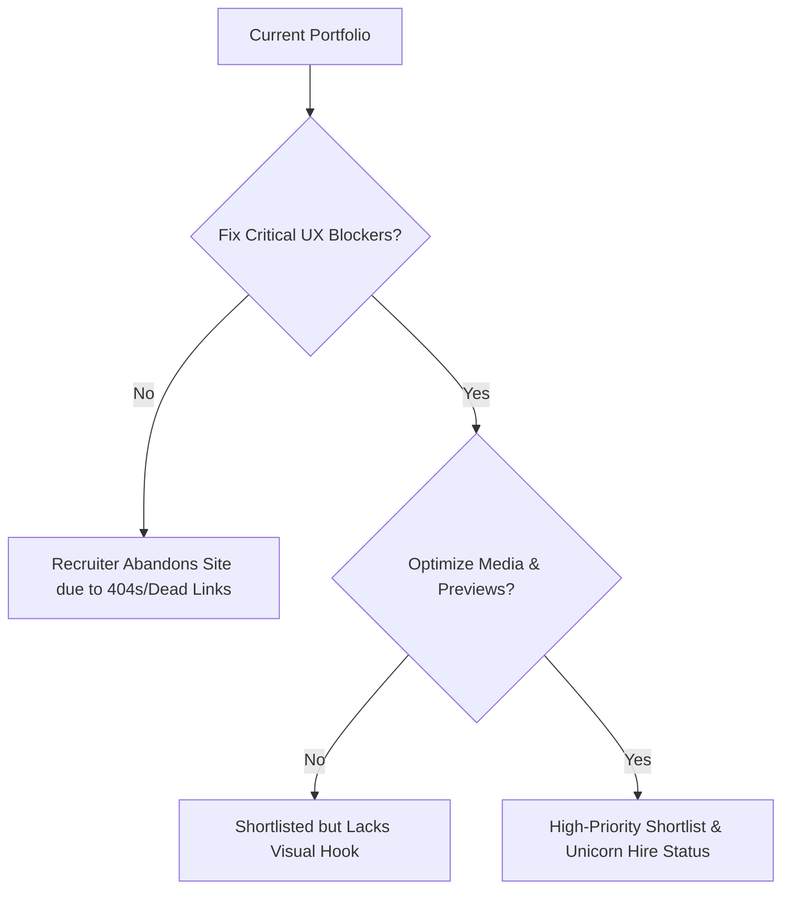

# Creative Recruiter & HR Portfolio Audit
## Candidate: Achmad Zaini — Motion Graphics Designer & Video Editor
**Audited by:** Lead Creative Recruiter @ Studio/Agency Perspective  
**Date:** May 30, 2026

---

## Executive Summary

As a creative recruiter at a top-tier digital design and branding agency, I look at dozens of portfolios daily. The average scan time before deciding to shortlist or reject a candidate is **30 to 45 seconds**. 

Achmad Zaini’s portfolio stands out immediately due to its sophisticated **Swiss Rationalist** aesthetic. The typography, grid discipline, and editorial feel are outstanding. It shows he understands styling, layout, and visual system design—skills highly coveted in motion designers who must work closely with brand guidelines.

However, behind the high-end design lies a massive technical blocker: **the navigation breaks upon clicking through to project details, leading to a 404 error because case study detail pages are missing from the codebase.** 

Below is an honest, constructive, and highly critical review from an HR and UX perspective, divided into four core pillars: **Visual & Brand Impression**, **Copy & Positioning**, **Navigation & Usability**, and **Creative Effectiveness**.

---

## Pillar 1: Visual & Brand Impression (First 5 Seconds)

### 🟢 The Good: High-End Sophistication
* **Visual Authority:** The brutalist, grid-based Swiss design system makes Zaini look like a premium, detail-oriented professional. It immediately separates him from the sea of generic Wix/Squarespace templates or messy creative portfolios.
* **Thematic Dark Mode Toggle:** The clean toggle in the header works seamlessly. Allowing recruiters to switch between layouts shows a deep respect for modern UI/UX design.
* **Stunning Motion Micro-interactions:** The subtle GSAP reveal lines, word-by-word fade-ins on the hero text, and smooth scrolling (via Lenis) demonstrate execution skills that align perfectly with a motion graphics designer's brand.

### 🔴 The Critique: "Where is the Motion?"
* **The Static Paradox:** For a *Motion Graphics Designer*, the home page is surprisingly still. A creative recruiter wants to see things moving within the first 3 seconds. The use of custom-generated static poster placeholders (`poster.jpg`) is clean but does a disservice to a video specialist. 
* **Recommendation:** Incorporate auto-playing, muted, high-performance `.webm` or `.mp4` video loops directly on card hover or as part of the background layout to immediately hook the viewer's eyes.

---

## Pillar 2: Navigation & Usability (The 15-Second Test)

### 🟢 The Good: Scannable Hierarchy
* **Frictionless Top Navigation:** The header navigation (`Work`, `About`, `CV`, `Contact`) is standard, expected, and instantly recognizable. Recruiters hate looking for where the CV or the Work resides.
* **Embedded CV:** Having the CV directly on `/cv` as structured web text rather than forcing a recruiter to download an unknown file first is a massive win for mobile scanning.

### 🔴 The Critique: Broken Links & UX Dead-Ends (Critical Blocker)
* **The 404 Project Trap:** Both the `/work` cards (Khazar Grid) and the list items (Fluxum Rows) point to `/work/${project.slug}` (e.g., `/work/explainer-video-pipeline`). However, **the directory `src/pages/work/` contains no detail pages (`[slug].astro`)**. Clicking "More info" or clicking any project card throws a 404 error. This is an immediate dealbreaker for HR. A recruiter will assume the site is broken and close the tab.
* **Missing Resume Download:** Recruiter applicant tracking systems (ATS) and hiring managers still run on PDFs. There is **no downloadable PDF resume button** anywhere on `/cv`. Recruiters cannot easily print or attach Zaini's details to a client proposal.
* **Missing Interactive Links on Socials:** In `contact.astro`, the social links (`LinkedIn`, `Behance`) point to generic root domains (`https://linkedin.com`, `https://behance.net`) rather than Zaini’s specific profile links.

---

## Pillar 3: Copywriting, Positioning & Metrics (The 30-Second Scan)

### 🟢 The Good: Metrics-Driven Systems Pitch
* **The "Systems" Angle:** Framing himself as someone who "crafts motion systems that make complex stories feel effortless" is highly strategic. It positions Zaini as a high-level conceptual thinker rather than an assembly-line frame-cutter.
* **Strong Metrics:** The copy includes excellent numbers that recruiters crave:
  * *"Edited and delivered 90+ animated explainer videos in 10 months."* (Shows raw capacity and speed).
  * *"Reduced manual production time by 80% using AE scripting."* (Shows technical artistry and problem-solving).
  * *"GPA 3.78 / 4.00."* (Indicates work ethic and high academic capability).

### 🔴 The Critique: Rebranding "Local" to "Global"
* **Academic/Local Heavy Tone:** Many of the projects are tied to university tasks or local ventures (e.g., "Lampung Manuscripts AR", "ITERA Campus Environmental Graphics", "ID Card Lampung"). To a global recruiter or an agency handling major consumer brands, this can make the candidate feel slightly junior or regional.
* **Rebranding Recommendations:**
  * Instead of *"AR experience for Lampung Manuscripts"*, rebrand the focus to *"Immersive Cultural Heritage Interactive Experience Utilizing SparkAR & Spatial Typography"*.
  * Elevate *"E-Commerce Platform — idcardlampung.com"* to focus heavily on the **AI-Assisted Web Dev pipeline** and the **growth metrics** (online customer onboarding) rather than the local printing service itself.

---

## Pillar 4: Portfolio Content & Creative Effectiveness

Evaluating the projects listed in `projects.json` from a recruiter's eye:

### 💼 Portfolio Breakdown & ROI

| Project Name | HR Perception | Recruiter Recommendation |
| :--- | :--- | :--- |
| **Explainer Video Production Pipeline** | **Extremely Strong.** Shows scalability, template management, and optimization. Recruiters looking for studio editors love high-volume experience. | Make this the primary project. Emphasize the batch-rendering workflow and tool stack in detail. |
| **AR Learning Experience** | **Very High Value.** Spotlights future-facing spatial capabilities (AR/VR/SparkAR). | Highlight this for creative technologist roles. Explain the "81% usability rate" metric (how was it tested?). |
| **Automated Design Workflow System** | **Rare Skillset.** A motion designer who can write After Effects Expressions and automate tasks is a "unicorn" for production studios. | Give this a dedicated section. Show a GIF of the automated preview generator in action. |
| **Social Media Content System** | **Standard / Utility.** Good for social agency editing, but less impressive than AR or automation. | Shift focus toward the "2M+ total impressions" metric to show business outcomes. |

---

## The HR Verdict & Immediate Roadmap

### 📋 Priority Fix List for Zaini

1. **Fix the Project Links (Urgent):** 
   * *Option A:* Create a dynamic case study page at `src/pages/work/[slug].astro` that renders details using a shared template from `projects.json`.
   * *Option B (Temporary):* Make the cards open a lightboxes/video modals directly on the `/work` index page instead of navigating to a broken sub-page.
2. **Add a Resume PDF Link:** Add a clear `[Download PDF CV]` button right beneath the contact email in `/cv` and `/contact`.
3. **Embed Video Previews on Hover:** Leverage the `preview.mp4` / `previewWebm` links defined in `projects.json`. When a user hovers over a featured card or a standard row, play a silent, looping video preview of the motion graphics.
4. **Fix External Contact Links:** Update `contact.astro` so the links point to the actual Behance and LinkedIn profiles instead of the homepages of those websites.
5. **Add a Reel:** As a motion designer, a **60-second Showreel** is the absolute most important deliverable. Place a high-quality video play button right in the homepage Hero section ("Watch 2026 Showreel").

---

### Conclusion
This is a **visually spectacular portfolio** that successfully utilizes a complex grid style to project a high-end designer image. However, it is currently a "Ferrari without an engine" because the actual work details are inaccessible due to the 404 routes. Fix the linking structure, add instant video previews, and Zaini will easily command attention from high-paying international clients and agencies.
